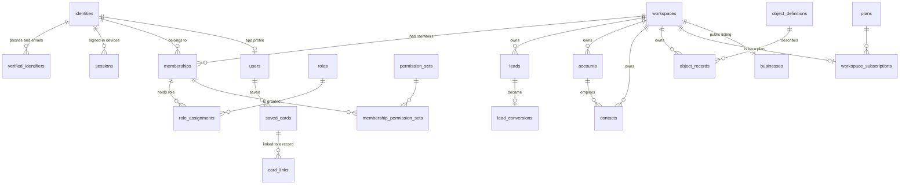
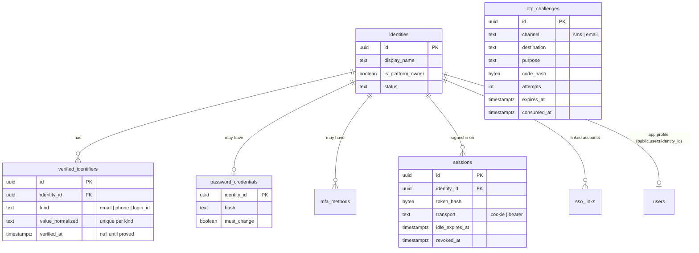
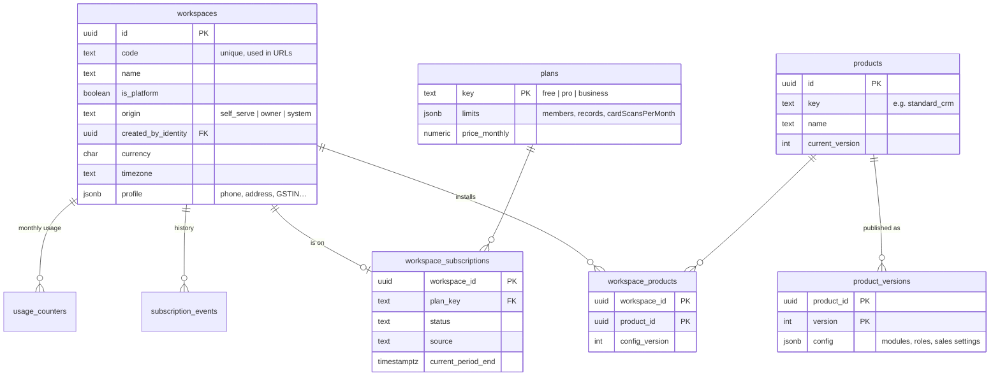
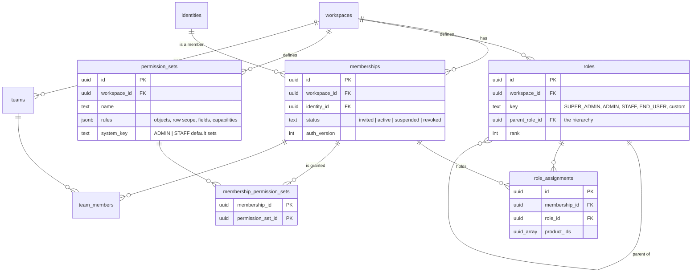
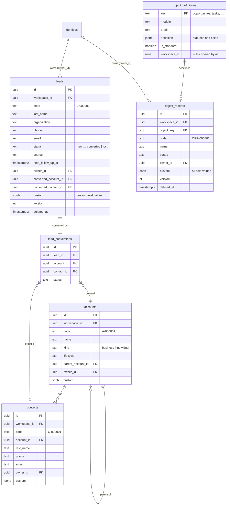
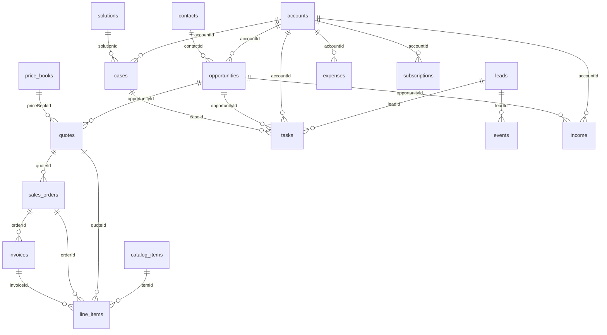
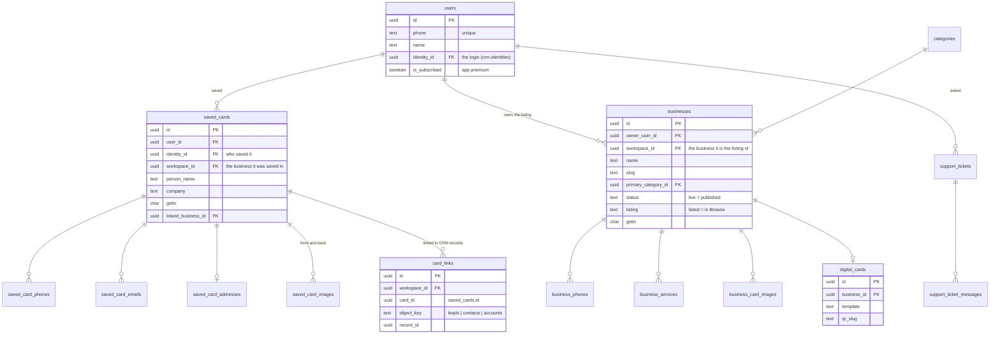

# Data model

How Ajay's CRM stores its data: every table, what it is for, and how the tables connect.
Written from the database itself on 5 Oct 2026 (CRM migrations 0001–0020, app migrations
001–015). Section 12 lists every column of every table.

## 1. The shape in one page

There is **one PostgreSQL database** with two schemas:

| Schema | What lives there | Tables |
|---|---|---|
| `crm` | People and sign-in, businesses, roles and permissions, all CRM records, email, automation, reports, plans | 64 |
| `public` | The card vault, the public directory (listings), app profiles, support tickets, app-store subscription events | 19 |

Four ideas explain almost everything:

1. **A person is an identity.** One row in `crm.identities` per person, whatever they sign
   in with (mobile code, email code, password, Google…). The app profile
   (`public.users`) hangs off it.
2. **A business is a workspace.** One row in `crm.workspaces` per business. *Every* customer
   record carries that business's id in a `workspace_id` column, and every query filters on
   it. Two businesses never see each other's rows — even when the same person owns both.
3. **A person belongs to a business through a membership**, and what they may do there comes
   from **permission sets**; their **role** places them in the hierarchy (who sees whose
   records).
4. **Records come in two kinds.** Leads, accounts and contacts have their own tables. Every
   other object — deals, tasks, meetings, cases, income, expenses, quotes, invoices, and any
   object a business invents — is a row in `crm.object_records`, described by a row in
   `crm.object_definitions`.

## 2. Words on screen → tables

| On screen | In the database |
|---|---|
| Business (customer side), Product (owner console) | `crm.workspaces` |
| App / setup (owner console) | `crm.products` + `crm.product_versions`, installed through `crm.workspace_products` |
| User, teammate | `crm.identities` + a `crm.memberships` row per business |
| Role | `crm.roles` (hierarchy), assigned in `crm.role_assignments` |
| Permission set | `crm.permission_sets`, granted in `crm.membership_permission_sets` |
| Lead / Account / Contact | `crm.leads` / `crm.accounts` / `crm.contacts` |
| Opportunity (deal), Task, Calendar event, Note, Communication, Case | `crm.object_records` with `object_key` = `opportunities`, `tasks`, `events`, `notes`, `communications`, `cases` |
| Income, Expense | `crm.object_records` with `object_key` = `income`, `expenses` |
| Catalog, Price book, Quote, Sales order, Invoice, Purchase order, Line item, Subscription | `crm.object_records` (`catalog_items`, `price_books`, `quotes`, `sales_orders`, `invoices`, `purchase_orders`, `line_items`, `subscriptions`) |
| Knowledge base article | `crm.object_records` with `object_key` = `solutions` |
| Custom object / custom field | `crm.object_definitions` (per business) / `crm.field_definitions` |
| Record timeline, notes, call log | `crm.activities` |
| Business card (My Cards) | `public.saved_cards` and its `saved_card_*` tables |
| Card linked to a lead or contact | `crm.card_links` |
| Listing in Browse, digital card, QR | `public.businesses`, `public.digital_cards` |
| Plan (Free / Pro / Business) | `crm.plans`, `crm.workspace_subscriptions` |

## 3. People and sign-in

- A mobile number or email belongs to exactly one identity (`UNIQUE (kind, namespace, value_normalized)`).
  It only counts once `verified_at` is set.
- Codes are never stored: `otp_challenges.code_hash` is a hash, each code expires, works
  once (`consumed_at`) and is cancelled after too many wrong `attempts`.
- A session token is stored only as `token_hash`. Browsers hold it in an HttpOnly cookie
  (`transport = cookie`); the native app holds a bearer token (`transport = bearer`).
- `identities.is_platform_owner` marks the owner-console login. It is the only platform-level
  privilege; everything else is per business.

## 4. Businesses, setups and plans

- A customer who creates a business gets a `workspaces` row with `origin = self_serve`, the
  `standard_crm` setup installed, and becomes its Super Admin.
- A business's plan is worked out in this order: its own live `workspace_subscriptions` row →
  a business the owner provisioned (no limits) → the creator holds the app's premium
  subscription (`public.users.is_subscribed`, treated as Pro) → the plan with
  `plans.is_default`.
- Limits are enforced where rows are created; usage is counted from the real tables plus
  `usage_counters` for monthly card scans.

## 5. Members, roles and permissions

- One person, many businesses: one `memberships` row per (business, person) — unique together.
- **Role = position** in the tree (a member with row scope "own" sees their own records and
  those of everyone in roles below theirs). **Permission sets = what they may do.** Super
  Admin always has everything.
- `permission_sets.rules` (JSON) holds, per object, the allowed actions and the row scope
  (`own` or `workspace`), restricted fields, and capabilities such as `dashboard.view`,
  `members.manage`, `access.manage`, `workflows.manage`.

## 6. CRM records

Every record table has the same backbone:

| Column | Meaning |
|---|---|
| `workspace_id` | The business the record belongs to. Never changes. |
| `code` | Human number, unique per business (`L-000001`, `OPP-000007`), from `crm.code_counters`. |
| `owner_id` | The member responsible. Row scope "own" filters on it. |
| `custom` | JSON. For leads/accounts/contacts: values of custom fields. For `object_records`: every field value. |
| `version` | Rises on each change; an edit sends the version it saw, so two people can't overwrite each other silently. |
| `deleted_at`, `deleted_by` | Recycle bin: a deleted record is hidden, not removed, until destroyed. |
| `created_by`, `updated_by`, `created_at`, `updated_at` | Who and when. |

**Links between objects stored as data** (a task's lead, a quote's account) are ids kept in
`custom` — e.g. `custom->>'accountId'`. They are checked when saved (same business, record
exists) but are not database foreign keys.

## 7. Objects stored as data

Each object below is one row in `crm.object_definitions` (shared by every business) and its
records are rows in `crm.object_records`. A view `crm.obj_<key>` exists for each
(`crm.obj_tasks`, `crm.obj_opportunities`, …) for reporting.

#### Cases — `cases` (code `CS-…`, module `tickets`)

Subject is the record's `name`. Statuses: New, Working, Escalated, Resolved, Closed.

| Field | Type | Links to |
|---|---|---|
| `priority` — Priority | select |  |
| `origin` — Origin | select |  |
| `accountId` — Account | lookup | `accounts` |
| `contactId` — Contact | lookup | `contacts` |
| `description` — Description | richtext |  |
| `resolution` — Resolution | richtext |  |
| `category` — Category | select |  |
| `slaDueAt` — Respond by | datetime |  |
| `closedAt` — Closed on | datetime |  |
| `solutionId` — Knowledge article | lookup | `solutions` |

#### Catalog — `catalog_items` (code `ITM-…`, module `catalog`)

Item name is the record's `name`. Statuses: Active, Inactive.

| Field | Type | Links to |
|---|---|---|
| `sku` — SKU | text |  |
| `unitPrice` — Unit price | currency |  |
| `unit` — Unit | text |  |
| `category` — Category | text |  |
| `taxRate` — Tax rate | percent |  |
| `description` — Description | textarea |  |
| `cost` — Cost | currency |  |

#### Communications — `communications` (code `COM-…`, module `communications`)

Subject is the record's `name`. Statuses: Logged, Sent, Received, Failed.

| Field | Type | Links to |
|---|---|---|
| `channel` — Channel (required) | select |  |
| `direction` — Direction | select |  |
| `occurredAt` — When | datetime |  |
| `accountId` — Account | lookup | `accounts` |
| `contactId` — Contact | lookup | `contacts` |
| `leadId` — Lead | lookup | `leads` |
| `body` — Message | textarea |  |
| `durationMinutes` — Duration (minutes) | number |  |
| `opportunityId` — Opportunity | lookup | `opportunities` |
| `caseId` — Case | lookup | `cases` |

#### Calendar events — `events` (code `EVT-…`, module `calendar`)

Subject is the record's `name`. Statuses: Planned, Held, Cancelled.

| Field | Type | Links to |
|---|---|---|
| `startsAt` — Starts (required) | datetime |  |
| `endsAt` — Ends | datetime |  |
| `location` — Location | text |  |
| `meetingLink` — Meeting link | url |  |
| `accountId` — Account | lookup | `accounts` |
| `contactId` — Contact | lookup | `contacts` |
| `leadId` — Lead | lookup | `leads` |
| `description` — Description | richtext |  |
| `attendees` — Attendees | text |  |
| `reminderMinutes` — Reminder | select |  |
| `kind` — Type | select |  |
| `opportunityId` — Opportunity | lookup | `opportunities` |
| `caseId` — Case | lookup | `cases` |

#### Expenses — `expenses` (code `EXP-…`, module `finance`)

Title is the record's `name`. Statuses: Paid, Pending, Cancelled.

| Field | Type | Links to |
|---|---|---|
| `amount` — Amount (required) | currency |  |
| `date` — Date (required) | date |  |
| `category` — Category | select |  |
| `vendor` — Paid to | text |  |
| `paymentMethod` — Payment method | select |  |
| `accountId` — Account | lookup | `accounts` |
| `reference` — Reference | text |  |
| `recurring` — Repeats | select |  |
| `description` — Notes | textarea |  |

#### Income — `income` (code `INC-…`, module `finance`)

Title is the record's `name`. Statuses: Received, Pending, Cancelled.

| Field | Type | Links to |
|---|---|---|
| `amount` — Amount (required) | currency |  |
| `date` — Date (required) | date |  |
| `category` — Category | select |  |
| `paymentMethod` — Payment method | select |  |
| `accountId` — Account | lookup | `accounts` |
| `contactId` — Contact | lookup | `contacts` |
| `opportunityId` — Opportunity | lookup | `opportunities` |
| `reference` — Reference | text |  |
| `recurring` — Repeats | select |  |
| `description` — Notes | textarea |  |

#### Invoices — `invoices` (code `INV-…`, module `sales_docs`)

Invoice name is the record's `name`. Statuses: Draft, Sent, Partially paid, Paid, Overdue, Void.

| Field | Type | Links to |
|---|---|---|
| `accountId` — Account | lookup | `accounts` |
| `contactId` — Contact | lookup | `contacts` |
| `orderId` — Sales order | lookup | `sales_orders` |
| `invoiceDate` — Invoice date | date |  |
| `dueDate` — Due date | date |  |
| `subtotal` — Subtotal | currency |  |
| `tax` — Tax | currency |  |
| `total` — Total | currency |  |
| `amountPaid` — Amount paid | currency |  |
| `description` — Notes | textarea |  |

#### Line items — `line_items` (code `LI-…`, module `sales_docs`)

Item is the record's `name`. Statuses: —.

| Field | Type | Links to |
|---|---|---|
| `itemId` — Catalog item | lookup | `catalog_items` |
| `quantity` — Quantity | number |  |
| `unitPrice` — Unit price | currency |  |
| `discountPercent` — Discount | percent |  |
| `total` — Line total | currency |  |
| `opportunityId` — Opportunity | lookup | `opportunities` |
| `quoteId` — Quote | lookup | `quotes` |
| `orderId` — Sales order | lookup | `sales_orders` |
| `invoiceId` — Invoice | lookup | `invoices` |
| `priceBookId` — Price book | lookup | `price_books` |

#### Notes — `notes` (code `NTE-…`, module `notes`)

Title is the record's `name`. Statuses: —.

| Field | Type | Links to |
|---|---|---|
| `body` — Note (required) | richtext |  |
| `accountId` — Account | lookup | `accounts` |
| `contactId` — Contact | lookup | `contacts` |
| `leadId` — Lead | lookup | `leads` |
| `opportunityId` — Opportunity | lookup | `opportunities` |

#### Opportunities — `opportunities` (code `OPP-…`, module `opportunities`)

Opportunity name is the record's `name`. Statuses: Prospecting, Qualification, Proposal, Negotiation, Closed won, Closed lost.

| Field | Type | Links to |
|---|---|---|
| `accountId` — Account | lookup | `accounts` |
| `contactId` — Primary contact | lookup | `contacts` |
| `amount` — Amount | currency |  |
| `probability` — Probability | percent |  |
| `closeDate` — Close date (required) | date |  |
| `type` — Type | select |  |
| `leadSource` — Lead source | select |  |
| `nextStep` — Next step | text |  |
| `description` — Description | richtext |  |
| `pipeline` — Pipeline | select |  |
| `forecastCategory` — Forecast category | select |  |
| `lostReason` — Lost reason | text |  |
| `priceBookId` — Price book | lookup | `price_books` |

#### Price books — `price_books` (code `PB-…`, module `sales_docs`)

Price book name is the record's `name`. Statuses: Active, Inactive.

| Field | Type | Links to |
|---|---|---|
| `validFrom` — Valid from | date |  |
| `validTo` — Valid to | date |  |
| `description` — Description | textarea |  |

#### Purchase orders — `purchase_orders` (code `PO-…`, module `sales_docs`)

Order name is the record's `name`. Statuses: Draft, Ordered, Received, Cancelled.

| Field | Type | Links to |
|---|---|---|
| `vendor` — Supplier | text |  |
| `accountId` — Supplier account | lookup | `accounts` |
| `orderDate` — Order date | date |  |
| `expectedDate` — Expected on | date |  |
| `total` — Total | currency |  |
| `description` — Notes | textarea |  |

#### Quotes — `quotes` (code `QT-…`, module `sales_docs`)

Quote name is the record's `name`. Statuses: Draft, Sent, Accepted, Declined, Expired.

| Field | Type | Links to |
|---|---|---|
| `accountId` — Account | lookup | `accounts` |
| `contactId` — Contact | lookup | `contacts` |
| `opportunityId` — Opportunity | lookup | `opportunities` |
| `priceBookId` — Price book | lookup | `price_books` |
| `quoteDate` — Quote date | date |  |
| `validUntil` — Valid until | date |  |
| `subtotal` — Subtotal | currency |  |
| `discount` — Discount | currency |  |
| `tax` — Tax | currency |  |
| `total` — Total | currency |  |
| `terms` — Terms | textarea |  |
| `description` — Notes | textarea |  |

#### Sales orders — `sales_orders` (code `SO-…`, module `sales_docs`)

Order name is the record's `name`. Statuses: Draft, Confirmed, Shipped, Delivered, Cancelled.

| Field | Type | Links to |
|---|---|---|
| `accountId` — Account | lookup | `accounts` |
| `contactId` — Contact | lookup | `contacts` |
| `opportunityId` — Opportunity | lookup | `opportunities` |
| `quoteId` — Quote | lookup | `quotes` |
| `orderDate` — Order date | date |  |
| `deliveryDate` — Delivery date | date |  |
| `subtotal` — Subtotal | currency |  |
| `tax` — Tax | currency |  |
| `total` — Total | currency |  |
| `description` — Notes | textarea |  |

#### Knowledge base — `solutions` (code `KB-…`, module `knowledge`)

Title is the record's `name`. Statuses: Draft, Published, Archived.

| Field | Type | Links to |
|---|---|---|
| `category` — Category | text |  |
| `body` — Answer (required) | richtext |  |
| `keywords` — Keywords | text |  |

#### Subscriptions — `subscriptions` (code `SUB-…`, module `subscriptions`)

Subscription name is the record's `name`. Statuses: Trial, Active, Past due, Cancelled, Expired.

| Field | Type | Links to |
|---|---|---|
| `accountId` — Account (required) | lookup | `accounts` |
| `contactId` — Contact | lookup | `contacts` |
| `plan` — Plan | text |  |
| `amount` — Amount | currency |  |
| `billingPeriod` — Billing period | select |  |
| `startDate` — Start date | date |  |
| `endDate` — End date | date |  |
| `autoRenew` — Renews automatically | boolean |  |
| `description` — Notes | textarea |  |

#### Tasks — `tasks` (code `TSK-…`, module `tasks`)

Subject is the record's `name`. Statuses: Not started, In progress, Waiting on someone, Completed, Deferred.

| Field | Type | Links to |
|---|---|---|
| `dueDate` — Due date | date |  |
| `priority` — Priority | select |  |
| `accountId` — Account | lookup | `accounts` |
| `contactId` — Contact | lookup | `contacts` |
| `leadId` — Lead | lookup | `leads` |
| `opportunityId` — Opportunity | lookup | `opportunities` |
| `description` — Comments | richtext |  |
| `recurrence` — Repeats | select |  |
| `reminderAt` — Remind me | datetime |  |
| `caseId` — Case | lookup | `cases` |

A business can add **its own objects** (a row in `crm.object_definitions` with its
`workspace_id`) and **its own fields** on any object (`crm.field_definitions`). They behave
like the standard ones everywhere: lists, forms, permissions, reports, the API and the phone
layout.

## 8. Timeline, email, automation, reports

- **Timeline** — `crm.activities`: one row per thing that happened to a record (created,
  fields changed, note, call, card scanned, converted…). `kind` says what, `detail` (JSON)
  holds the specifics, `actor_id` who.
- **Files** — `crm.files`: attachments on a record.
- **Audit** — `crm.audit_events`: every sensitive change with before/after, written in the same
  transaction as the change itself.
- **Email** — a member connects a mailbox (`crm.mail_accounts`); emails are `crm.messages`,
  tied to records by `crm.message_links`. Bulk email is `crm.campaigns` →
  `crm.campaign_recipients`; opt-outs are `crm.unsubscribes`.
- **Automation** — `crm.workflows` (draft and published definition), each publish kept in
  `crm.workflow_versions`, each execution in `crm.workflow_runs`. Record changes are written to
  `crm.outbox_events` and relayed to workflows, `crm.webhooks` (→ `crm.webhook_deliveries`) and
  live updates.
- **Reports** — `crm.reports` (one object, filters, grouping, totals) and `crm.dashboards`
  (report widgets). They always run with the viewer's own permissions and business.

## 9. Cards, directory and the app profile

**How the two schemas connect** (these four columns are the whole bridge):

| Column | Points at | Meaning |
|---|---|---|
| `public.users.identity_id` | `crm.identities.id` | The app profile of a login. |
| `public.saved_cards.identity_id` | `crm.identities.id` | Who saved the card. |
| `public.saved_cards.workspace_id` | `crm.workspaces.id` | The business the card was saved in. |
| `public.businesses.workspace_id` | `crm.workspaces.id` | The business this listing is the public face of. |

And one in the other direction: `crm.card_links.card_id` holds a `public.saved_cards.id`.

A scanned card is matched **only against the leads, contacts and accounts of the business it
was scanned in** (last 10 digits of a phone, lower-cased email, exact company name). The
directory (`public.businesses`) is the only data that other people can see; it never contains
CRM records.

## 10. Rules that hold everywhere

- **Tenant isolation.** Every query on customer data filters `workspace_id` by the business in
  the URL, after checking the caller's active membership in it. A non-member gets 403; an id
  from another business gets 404.
- **Row scope.** With scope "own", a member sees records where `owner_id` is them or someone in
  a role below theirs.
- **Soft delete.** Records go to the recycle bin (`deleted_at`); permanent removal is a
  separate permission.
- **Optimistic locking.** `version` on every record.
- **No secrets in clear.** Passwords, session tokens, one-time codes, API keys and invitation
  tokens are stored as hashes; mailbox, SSO and webhook secrets are encrypted
  (`*_enc` columns, key in `CRM_ENCRYPTION_KEY_BASE64`).
- **Audit and events are written with the change**, in the same transaction.
- **Plan limits** are checked on the server where records, members and card scans are created.
- **Migrations only add.** The one deliberate exception is the fresh start
  (`CRM_FRESH_START`, see HANDOVER.md), which erases customer data on purpose.

## 11. Tables that exist only on the live database

The live database was created from the app's full schema (`001_initial_schema.sql`, which
needs PostGIS). It has these extra `public` tables that a local database without PostGIS does
not have. They are listed from that file, **not checked against live**:

`analytics_events`, `audit_logs`, `business_categories`, `business_media`,
`business_verifications`, `credit_ledger`, `devices`, `enquiries`, `favorites`, `purchases`,
`reports`, `scan_records`, `subscriptions`, `user_kyc`.

On live, `public.businesses` also stores its position as a PostGIS `location` column (plus
`search_tsv` for text search and `trade_name`) instead of the `latitude` / `longitude`
columns shown in section 12.

## 12. Every table, every column

Generated from the database itself (schemas `crm` and `public`). "Required" means the column cannot be empty.

### Identity and sign-in

#### `crm.identities`

One row per person who can sign in (customer, teammate or platform owner). The single login record for the app and the CRM.

| Column | Type | Required | Notes |
|---|---|---|---|
| `id` | uuid | yes | primary key |
| `display_name` | text | yes |  |
| `is_platform_owner` | boolean | yes | default false |
| `status` | text | yes | default 'active' |
| `locale` | text | yes | default 'en' |
| `timezone` | text | yes | default 'Asia/Kolkata' |
| `last_login_at` | timestamptz | no |  |
| `created_at` | timestamptz | yes |  |
| `updated_at` | timestamptz | yes |  |
| `source` | text | no |  |

#### `crm.verified_identifiers`

A person's email addresses and mobile numbers. `verified_at` is set only after a code sent there was typed back. One value belongs to one person.

| Column | Type | Required | Notes |
|---|---|---|---|
| `id` | uuid | yes | primary key |
| `identity_id` | uuid | yes | → `crm.identities`, deleted with it |
| `kind` | text | yes |  |
| `value_normalized` | text | yes |  |
| `namespace` | text | yes | default 'global' |
| `verified_at` | timestamptz | no |  |

Unique: (`kind`, `namespace`, `value_normalized`)

#### `crm.password_credentials`

The password hash of a person who has set one (argon2id), with lock-out counters.

| Column | Type | Required | Notes |
|---|---|---|---|
| `identity_id` | uuid | yes | primary key; → `crm.identities`, deleted with it |
| `hash` | text | yes |  |
| `must_change` | boolean | yes | default false |
| `failed_attempts` | integer | yes | default 0 |
| `locked_until` | timestamptz | no |  |
| `updated_at` | timestamptz | yes |  |

#### `crm.mfa_methods`

Authenticator-app second factor and recovery codes (encrypted / hashed).

| Column | Type | Required | Notes |
|---|---|---|---|
| `id` | uuid | yes | primary key |
| `identity_id` | uuid | yes | → `crm.identities`, deleted with it |
| `kind` | text | yes | default 'totp' |
| `secret_enc` | bytea | yes |  |
| `recovery_codes_hash` | text[] | yes | default '{}'[] |
| `last_used_step` | bigint | yes | default 0 |
| `confirmed_at` | timestamptz | no |  |
| `created_at` | timestamptz | yes |  |

#### `crm.sessions`

Every sign-in. `transport` is `cookie` (browser) or `bearer` (native app). Revoking a row signs that device out.

| Column | Type | Required | Notes |
|---|---|---|---|
| `id` | uuid | yes | primary key |
| `identity_id` | uuid | yes | → `crm.identities`, deleted with it |
| `token_hash` | bytea | yes |  |
| `audience` | text | yes | default 'workspace' |
| `selected_membership_id` | uuid | no |  |
| `selected_product_id` | uuid | no |  |
| `mfa_required` | boolean | yes | default false |
| `mfa_passed` | boolean | yes | default false |
| `mfa_attempts` | integer | yes | default 0 |
| `recent_auth_at` | timestamptz | no |  |
| `privileged` | boolean | yes | default false |
| `ip` | inet | no |  |
| `user_agent` | text | no |  |
| `created_at` | timestamptz | yes |  |
| `last_seen_at` | timestamptz | yes |  |
| `idle_expires_at` | timestamptz | yes |  |
| `absolute_expires_at` | timestamptz | yes |  |
| `revoked_at` | timestamptz | no |  |
| `auth_method` | text | yes | default 'password' |
| `transport` | text | yes | default 'cookie' |

Unique: (`token_hash`)

#### `crm.otp_challenges`

One-time codes sent by SMS or email: hashed, expiring, single-use, attempt-limited. `purpose` says what the code is for (login, change_phone, verify_email).

| Column | Type | Required | Notes |
|---|---|---|---|
| `id` | uuid | yes | primary key |
| `channel` | text | yes |  |
| `destination` | text | yes |  |
| `purpose` | text | yes |  |
| `code_hash` | bytea | yes |  |
| `attempts` | integer | yes | default 0 |
| `expires_at` | timestamptz | yes |  |
| `consumed_at` | timestamptz | no |  |
| `created_at` | timestamptz | yes |  |

#### `crm.password_resets`

Single-use "forgot password" tokens (hashed).

| Column | Type | Required | Notes |
|---|---|---|---|
| `token_hash` | bytea | yes | primary key |
| `identity_id` | uuid | yes | → `crm.identities`, deleted with it |
| `expires_at` | timestamptz | yes |  |
| `used_at` | timestamptz | no |  |
| `created_at` | timestamptz | yes |  |

#### `crm.sso_links`

Links a person to their Google / Microsoft / LinkedIn / company-SSO account.

| Column | Type | Required | Notes |
|---|---|---|---|
| `provider` | text | yes | part of the primary key |
| `subject` | text | yes | part of the primary key |
| `identity_id` | uuid | yes | → `crm.identities`, deleted with it |
| `email_at_link` | text | no |  |
| `created_at` | timestamptz | yes |  |

#### `crm.sso_providers`

Company single sign-on (SAML or OpenID Connect) configured for one business.

| Column | Type | Required | Notes |
|---|---|---|---|
| `id` | uuid | yes | primary key |
| `workspace_id` | uuid | yes | → `crm.workspaces` |
| `kind` | text | yes | default 'saml' |
| `name` | text | yes |  |
| `status` | text | yes | default 'active' |
| `idp_metadata_xml` | text | yes | default '' |
| `domains` | text[] | yes | default '{}'[] |
| `jit_provisioning` | boolean | yes | default false |
| `default_role_key` | text | yes | default 'STAFF' |
| `sp_key_enc` | bytea | no |  |
| `sp_cert_pem` | text | no |  |
| `created_by` | uuid | no |  |
| `created_at` | timestamptz | yes |  |
| `updated_at` | timestamptz | yes |  |
| `oidc_issuer` | text | yes | default '' |
| `oidc_client_id` | text | yes | default '' |
| `oidc_secret_enc` | bytea | no |  |

Unique: (`workspace_id`)

#### `crm.invitations`

An invitation to join a business with a role, sent by email; accepted once.

| Column | Type | Required | Notes |
|---|---|---|---|
| `id` | uuid | yes | primary key |
| `workspace_id` | uuid | yes | the business (tenant) — → `crm.workspaces` |
| `membership_id` | uuid | yes | → `crm.memberships` |
| `lead_id` | uuid | no |  |
| `token_hash` | bytea | yes |  |
| `intended_role_id` | uuid | yes | → `crm.roles` |
| `product_ids` | uuid[] | yes |  |
| `permission_set_ids` | uuid[] | yes | default '{}'::uuid[] |
| `delivery_channel` | text | yes |  |
| `status` | text | yes | default 'pending' |
| `expires_at` | timestamptz | yes |  |
| `accepted_at` | timestamptz | no |  |
| `created_by` | uuid | yes | → `crm.identities` |
| `created_at` | timestamptz | yes |  |

Unique: (`token_hash`)

#### `crm.invite_links`

A reusable "join this business" link, limited to company email domains.

| Column | Type | Required | Notes |
|---|---|---|---|
| `workspace_id` | uuid | yes | primary key; → `crm.workspaces` |
| `token_hash` | bytea | yes |  |
| `token_enc` | bytea | yes |  |
| `domains` | text[] | yes | default '{}'[] |
| `role_key` | text | yes | default 'STAFF' |
| `status` | text | yes | default 'active' |
| `uses` | integer | yes | default 0 |
| `created_by` | uuid | no |  |
| `created_at` | timestamptz | yes |  |
| `updated_at` | timestamptz | yes |  |

Unique: (`token_hash`)

### Businesses, setups and plans

#### `crm.workspaces`

A **business** (the tenant). Every customer record carries its `id` as `workspace_id`. `origin` is `self_serve` (a customer created it), `owner` (the platform owner provisioned it) or `system`. `profile` holds the business details (phone, address, GSTIN…). One row has `is_platform = true`: the owner's own workspace.

| Column | Type | Required | Notes |
|---|---|---|---|
| `id` | uuid | yes | primary key |
| `code` | text | yes |  |
| `name` | text | yes |  |
| `is_platform` | boolean | yes | default false |
| `status` | text | yes | default 'draft' |
| `timezone` | text | yes | default 'Asia/Kolkata' |
| `locale` | text | yes | default 'en' |
| `currency` | text | yes | default 'INR'::bpchar |
| `branding` | jsonb | yes | default '{}' |
| `custom_domain` | text | no |  |
| `domain_verified_at` | timestamptz | no |  |
| `created_at` | timestamptz | yes |  |
| `updated_at` | timestamptz | yes |  |
| `bin_retention_days` | integer | no |  |
| `created_by_identity` | uuid | no | → `crm.identities` |
| `origin` | text | yes | default 'owner' |
| `profile` | jsonb | yes | default '{}' |

Unique: (`code`); (`custom_domain`)

#### `crm.products`

A **setup** (shown as "App" in the owner console): a named bundle of modules, roles and sales settings. `standard_crm` is the one every self-serve business gets.

| Column | Type | Required | Notes |
|---|---|---|---|
| `id` | uuid | yes | primary key |
| `key` | text | yes |  |
| `name` | text | yes |  |
| `description` | text | no |  |
| `icon` | text | no |  |
| `status` | text | yes | default 'draft' |
| `current_version` | integer | no |  |
| `draft_config` | jsonb | yes | default '{}' |
| `created_by` | uuid | no | → `crm.identities` |
| `created_at` | timestamptz | yes |  |
| `updated_at` | timestamptz | yes |  |

Unique: (`key`)

#### `crm.product_versions`

Published versions of a setup. A business pins the version it installed.

| Column | Type | Required | Notes |
|---|---|---|---|
| `product_id` | uuid | yes | part of the primary key; → `crm.products` |
| `version` | integer | yes | part of the primary key |
| `config` | jsonb | yes |  |
| `published_at` | timestamptz | yes |  |
| `published_by` | uuid | no | → `crm.identities` |

#### `crm.workspace_products`

Which setups a business has installed, and at which version.

| Column | Type | Required | Notes |
|---|---|---|---|
| `workspace_id` | uuid | yes | part of the primary key; → `crm.workspaces` |
| `product_id` | uuid | yes | part of the primary key; → `crm.products` |
| `config_version` | integer | yes |  |
| `overrides` | jsonb | yes | default '{}' |
| `status` | text | yes | default 'active' |
| `created_at` | timestamptz | yes |  |

#### `crm.platform_settings`

Platform-wide switches, e.g. `self_serve` (may customers create businesses, and how many).

| Column | Type | Required | Notes |
|---|---|---|---|
| `key` | text | yes | primary key |
| `value` | jsonb | yes |  |
| `updated_by` | uuid | no | → `crm.identities` |
| `updated_at` | timestamptz | yes |  |

#### `crm.plans`

Price plans (Free, Pro, Business) with their limits (`members`, `records`, `cardScansPerMonth`; 0 = unlimited).

| Column | Type | Required | Notes |
|---|---|---|---|
| `key` | text | yes | primary key |
| `name` | text | yes |  |
| `description` | text | yes | default '' |
| `price_monthly` | numeric | yes | default 0 |
| `price_yearly` | numeric | yes | default 0 |
| `currency` | text | yes | default 'INR'::bpchar |
| `limits` | jsonb | yes | default '{}' |
| `features` | jsonb | yes | default '[]' |
| `is_default` | boolean | yes | default false |
| `is_active` | boolean | yes | default true |
| `position` | integer | yes | default 0 |
| `created_at` | timestamptz | yes |  |
| `updated_at` | timestamptz | yes |  |

#### `crm.workspace_subscriptions`

The plan a business is on: status, period end and where it came from (set by the owner, app store, …). At most one row per business; none means the default plan.

| Column | Type | Required | Notes |
|---|---|---|---|
| `workspace_id` | uuid | yes | primary key; → `crm.workspaces`, deleted with it |
| `plan_key` | text | yes | → `crm.plans` |
| `status` | text | yes | default 'active' |
| `source` | text | yes | default 'manual' |
| `started_at` | timestamptz | yes |  |
| `current_period_end` | timestamptz | no |  |
| `external_customer_id` | text | no |  |
| `external_ref` | text | no |  |
| `notes` | text | yes | default '' |
| `updated_by` | uuid | no | → `crm.identities` |
| `updated_at` | timestamptz | yes |  |

#### `crm.subscription_events`

History of plan changes for a business.

| Column | Type | Required | Notes |
|---|---|---|---|
| `id` | bigint | yes | primary key |
| `workspace_id` | uuid | yes | → `crm.workspaces`, deleted with it |
| `type` | text | yes |  |
| `plan_key` | text | no |  |
| `detail` | jsonb | yes | default '{}' |
| `actor_id` | uuid | no | → `crm.identities` |
| `created_at` | timestamptz | yes |  |

#### `crm.usage_counters`

Monthly counters per business (e.g. card scans) checked against plan limits.

| Column | Type | Required | Notes |
|---|---|---|---|
| `workspace_id` | uuid | yes | part of the primary key; → `crm.workspaces`, deleted with it |
| `metric` | text | yes | part of the primary key |
| `period` | date | yes | part of the primary key |
| `value` | bigint | yes | default 0 |

### Members, roles and permissions

#### `crm.memberships`

A person belongs to a business. `status`: invited, active, suspended, revoked. `auth_version` rises when their access changes so open sessions re-check.

| Column | Type | Required | Notes |
|---|---|---|---|
| `id` | uuid | yes | primary key |
| `workspace_id` | uuid | yes | → `crm.workspaces` |
| `identity_id` | uuid | yes | → `crm.identities` |
| `status` | text | yes | default 'invited' |
| `user_type` | text | no |  |
| `auth_version` | integer | yes | default 1 |
| `created_by` | uuid | no | → `crm.identities` |
| `created_at` | timestamptz | yes |  |

Unique: (`workspace_id`, `identity_id`)

#### `crm.roles`

Positions in a business's hierarchy (Super Admin → Admin → Staff → End user, plus custom roles). `parent_role_id` forms the tree: a role sees the records of the roles below it.

| Column | Type | Required | Notes |
|---|---|---|---|
| `id` | uuid | yes | primary key |
| `workspace_id` | uuid | yes | → `crm.workspaces` |
| `key` | text | yes |  |
| `name` | text | yes |  |
| `is_system` | boolean | yes | default false |
| `rank` | integer | yes |  |
| `base_rules` | jsonb | yes |  |
| `description` | text | no |  |
| `customized` | boolean | yes | default false |
| `created_by` | uuid | no | → `crm.identities` |
| `created_at` | timestamptz | yes |  |
| `updated_at` | timestamptz | yes |  |
| `parent_role_id` | uuid | no | → `crm.roles`, cleared if it is deleted |

Unique: (`workspace_id`, `key`)

#### `crm.role_assignments`

The role a membership holds, and for which installed setups (`product_ids`).

| Column | Type | Required | Notes |
|---|---|---|---|
| `id` | uuid | yes | primary key |
| `workspace_id` | uuid | yes | the business (tenant) — → `crm.workspaces` |
| `membership_id` | uuid | yes | → `crm.memberships`, deleted with it |
| `role_id` | uuid | yes | → `crm.roles` |
| `product_ids` | uuid[] | yes |  |
| `branch_ids` | uuid[] | yes | default '{}'::uuid[] |
| `granted_by` | uuid | yes | → `crm.identities` |
| `expires_at` | timestamptz | no |  |
| `created_at` | timestamptz | yes |  |

#### `crm.permission_sets`

A named set of rules: per object which actions (read, create, update, delete, convert, import, export, destroy), row scope (own / whole business), field rules and capabilities. This is what actually grants access.

| Column | Type | Required | Notes |
|---|---|---|---|
| `id` | uuid | yes | primary key |
| `workspace_id` | uuid | yes | → `crm.workspaces` |
| `name` | text | yes |  |
| `rules` | jsonb | yes |  |
| `description` | text | no |  |
| `created_by` | uuid | no | → `crm.identities` |
| `created_at` | timestamptz | yes |  |
| `updated_at` | timestamptz | yes |  |
| `system_key` | text | no |  |

Unique: (`workspace_id`, `name`)

#### `crm.membership_permission_sets`

Which permission sets a member has.

| Column | Type | Required | Notes |
|---|---|---|---|
| `workspace_id` | uuid | yes | the business (tenant) — → `crm.workspaces` |
| `membership_id` | uuid | yes | part of the primary key; → `crm.memberships`, deleted with it |
| `permission_set_id` | uuid | yes | part of the primary key; → `crm.permission_sets` |
| `granted_by` | uuid | yes | → `crm.identities` |
| `expires_at` | timestamptz | no |  |

#### `crm.teams`

Named groups of members inside a business.

| Column | Type | Required | Notes |
|---|---|---|---|
| `id` | uuid | yes | primary key |
| `workspace_id` | uuid | yes | the business (tenant) — → `crm.workspaces` |
| `name` | text | yes |  |
| `description` | text | yes | default '' |
| `created_at` | timestamptz | yes |  |

Unique: (`workspace_id`, `name`)

#### `crm.team_members`

Members of a team.

| Column | Type | Required | Notes |
|---|---|---|---|
| `workspace_id` | uuid | yes | the business (tenant) — → `crm.workspaces` |
| `team_id` | uuid | yes | part of the primary key; → `crm.teams`, deleted with it |
| `membership_id` | uuid | yes | part of the primary key; → `crm.memberships`, deleted with it |

#### `crm.api_keys`

Keys for the public API of one business (hashed), with a role or permission set.

| Column | Type | Required | Notes |
|---|---|---|---|
| `id` | uuid | yes | primary key |
| `workspace_id` | uuid | yes | the business (tenant) — → `crm.workspaces` |
| `name` | text | yes |  |
| `prefix` | text | yes |  |
| `key_hash` | bytea | yes |  |
| `permission_set_id` | uuid | no | → `crm.permission_sets` |
| `product_ids` | uuid[] | yes | default '{}'::uuid[] |
| `last_used_at` | timestamptz | no |  |
| `revoked_at` | timestamptz | no |  |
| `created_by` | uuid | yes |  |
| `created_at` | timestamptz | yes |  |
| `role_id` | uuid | no | → `crm.roles` |
| `expires_at` | timestamptz | no |  |
| `last_used_ip` | inet | no |  |

Unique: (`key_hash`)

### CRM records

#### `crm.leads`

A person or company that might buy. Has its own status flow (new → working → qualified → converted / lost), follow-up date and score. Converting creates an account and a contact.

| Column | Type | Required | Notes |
|---|---|---|---|
| `id` | uuid | yes | primary key |
| `workspace_id` | uuid | yes | → `crm.workspaces` |
| `product_id` | uuid | no | → `crm.products` |
| `code` | text | yes |  |
| `salutation` | text | no |  |
| `first_name` | text | no |  |
| `last_name` | text | no |  |
| `title` | text | no |  |
| `organization` | text | no |  |
| `email` | text | no |  |
| `phone` | text | no |  |
| `mobile` | text | no |  |
| `website` | text | no |  |
| `industry` | text | no |  |
| `source` | text | yes | default 'manual' |
| `status` | text | yes | default 'new' |
| `rating` | text | no |  |
| `lost_reason` | text | no |  |
| `annual_revenue` | numeric | no |  |
| `employees` | integer | no |  |
| `street` | text | no |  |
| `city` | text | no |  |
| `state` | text | no |  |
| `postal_code` | text | no |  |
| `country` | text | no |  |
| `description` | text | no |  |
| `user_type` | text | no |  |
| `intended_role_key` | text | no |  |
| `owner_id` | uuid | no | → `crm.identities` |
| `identity_id` | uuid | no | → `crm.identities` |
| `score` | integer | yes | default 0 |
| `tags` | text[] | yes | default '{}'[] |
| `next_follow_up_at` | timestamptz | no |  |
| `last_activity_at` | timestamptz | no |  |
| `converted_at` | timestamptz | no |  |
| `converted_account_id` | uuid | no | → `crm.accounts` |
| `converted_contact_id` | uuid | no | → `crm.contacts` |
| `custom` | jsonb | yes | default '{}' |
| `version` | integer | yes | default 1 |
| `deleted_at` | timestamptz | no |  |
| `created_by` | uuid | no |  |
| `updated_by` | uuid | no |  |
| `created_at` | timestamptz | yes |  |
| `updated_at` | timestamptz | yes |  |
| `deleted_by` | uuid | no |  |

Unique: (`workspace_id`, `code`)

#### `crm.accounts`

A company or individual customer. `parent_account_id` builds account hierarchies.

| Column | Type | Required | Notes |
|---|---|---|---|
| `id` | uuid | yes | primary key |
| `workspace_id` | uuid | yes | → `crm.workspaces` |
| `code` | text | yes |  |
| `kind` | text | yes | default 'business' |
| `name` | text | yes |  |
| `type` | text | no |  |
| `lifecycle` | text | yes | default 'prospect' |
| `industry` | text | no |  |
| `rating` | text | no |  |
| `ownership` | text | no |  |
| `website` | text | no |  |
| `email` | text | no |  |
| `phone` | text | no |  |
| `annual_revenue` | numeric | no |  |
| `employees` | integer | no |  |
| `billing_street` | text | no |  |
| `billing_city` | text | no |  |
| `billing_state` | text | no |  |
| `billing_postal_code` | text | no |  |
| `billing_country` | text | no |  |
| `shipping_street` | text | no |  |
| `shipping_city` | text | no |  |
| `shipping_state` | text | no |  |
| `shipping_postal_code` | text | no |  |
| `shipping_country` | text | no |  |
| `description` | text | no |  |
| `parent_account_id` | uuid | no | → `crm.accounts` |
| `customer_workspace_id` | uuid | no | → `crm.workspaces` |
| `owner_id` | uuid | no | → `crm.identities` |
| `identity_id` | uuid | no | → `crm.identities` |
| `custom` | jsonb | yes | default '{}' |
| `version` | integer | yes | default 1 |
| `deleted_at` | timestamptz | no |  |
| `created_by` | uuid | no |  |
| `updated_by` | uuid | no |  |
| `created_at` | timestamptz | yes |  |
| `updated_at` | timestamptz | yes |  |
| `deleted_by` | uuid | no |  |

Unique: (`workspace_id`, `code`)

#### `crm.contacts`

A person, usually at an account (`account_id`).

| Column | Type | Required | Notes |
|---|---|---|---|
| `id` | uuid | yes | primary key |
| `workspace_id` | uuid | yes | → `crm.workspaces` |
| `code` | text | yes |  |
| `account_id` | uuid | no | → `crm.accounts` |
| `salutation` | text | no |  |
| `first_name` | text | no |  |
| `last_name` | text | no |  |
| `title` | text | no |  |
| `department` | text | no |  |
| `email` | text | no |  |
| `phone` | text | no |  |
| `mobile` | text | no |  |
| `lead_source` | text | no |  |
| `birthdate` | date | no |  |
| `mailing_street` | text | no |  |
| `mailing_city` | text | no |  |
| `mailing_state` | text | no |  |
| `mailing_postal_code` | text | no |  |
| `mailing_country` | text | no |  |
| `description` | text | no |  |
| `owner_id` | uuid | no | → `crm.identities` |
| `identity_id` | uuid | no | → `crm.identities` |
| `custom` | jsonb | yes | default '{}' |
| `version` | integer | yes | default 1 |
| `deleted_at` | timestamptz | no |  |
| `created_by` | uuid | no |  |
| `updated_by` | uuid | no |  |
| `created_at` | timestamptz | yes |  |
| `updated_at` | timestamptz | yes |  |
| `deleted_by` | uuid | no |  |

Unique: (`workspace_id`, `code`)

#### `crm.lead_conversions`

What a lead became: the account, contact (and deal) created when it was converted.

| Column | Type | Required | Notes |
|---|---|---|---|
| `id` | uuid | yes | primary key |
| `workspace_id` | uuid | yes | the business (tenant) — → `crm.workspaces` |
| `lead_id` | uuid | yes | → `crm.leads` |
| `account_id` | uuid | no | → `crm.accounts` |
| `contact_id` | uuid | no | → `crm.contacts` |
| `workspace_provisioned_id` | uuid | no | → `crm.workspaces` |
| `invitation_id` | uuid | no | → `crm.invitations` |
| `trigger` | text | yes | default 'manual' |
| `status` | text | yes | default 'converted' |
| `converted_by` | uuid | no |  |
| `created_at` | timestamptz | yes |  |

#### `crm.object_definitions`

The definition of every other object: its names, code prefix, statuses and fields (`definition` JSON). Standard objects (`is_standard`) are shared by all businesses; a business can also define its own (`workspace_id` set).

| Column | Type | Required | Notes |
|---|---|---|---|
| `key` | text | yes | primary key |
| `module` | text | yes |  |
| `singular` | text | yes |  |
| `plural` | text | yes |  |
| `description` | text | yes | default '' |
| `icon` | text | yes | default 'box' |
| `prefix` | text | yes |  |
| `definition` | jsonb | yes | default '{}' |
| `is_standard` | boolean | yes | default false |
| `status` | text | yes | default 'active' |
| `created_by` | uuid | no |  |
| `created_at` | timestamptz | yes |  |
| `updated_at` | timestamptz | yes |  |
| `workspace_id` | uuid | no | → `crm.workspaces` |

Unique: (`prefix`)

#### `crm.object_records`

The records of every object defined as data — deals, tasks, events, notes, cases, income, expenses, quotes, invoices… `object_key` says which object; field values live in `custom` (JSON). See "Objects stored as data".

| Column | Type | Required | Notes |
|---|---|---|---|
| `id` | uuid | yes | primary key |
| `workspace_id` | uuid | yes | → `crm.workspaces` |
| `object_key` | text | yes | → `crm.object_definitions` |
| `code` | text | yes |  |
| `name` | text | yes |  |
| `status` | text | no |  |
| `owner_id` | uuid | no | → `crm.identities` |
| `custom` | jsonb | yes | default '{}' |
| `version` | integer | yes | default 1 |
| `deleted_at` | timestamptz | no |  |
| `created_by` | uuid | no |  |
| `updated_by` | uuid | no |  |
| `created_at` | timestamptz | yes |  |
| `updated_at` | timestamptz | yes |  |
| `deleted_by` | uuid | no |  |

Unique: (`workspace_id`, `object_key`, `code`)

#### `crm.field_definitions`

Custom fields a business added to an object (including to leads, accounts and contacts). Their values live in the record's `custom` JSON.

| Column | Type | Required | Notes |
|---|---|---|---|
| `id` | uuid | yes | primary key |
| `workspace_id` | uuid | yes | → `crm.workspaces` |
| `object_key` | text | yes |  |
| `key` | text | yes |  |
| `label` | text | yes |  |
| `type` | text | yes |  |
| `is_required` | boolean | yes | default false |
| `options` | jsonb | yes | default '{}' |
| `help_text` | text | no |  |
| `position` | integer | yes | default 0 |
| `status` | text | yes | default 'published' |
| `created_by` | uuid | no |  |
| `created_at` | timestamptz | yes |  |
| `updated_at` | timestamptz | yes |  |
| `is_unique` | boolean | yes | default false |
| `lookup_target` | text | no |  |

Unique: (`workspace_id`, `object_key`, `key`)

#### `crm.layouts`

The page layout of an object for one business: sections, field order, highlights.

| Column | Type | Required | Notes |
|---|---|---|---|
| `id` | uuid | yes | primary key |
| `workspace_id` | uuid | yes | → `crm.workspaces` |
| `object_key` | text | yes |  |
| `definition` | jsonb | yes |  |
| `status` | text | yes | default 'published' |
| `updated_by` | uuid | no |  |
| `updated_at` | timestamptz | yes |  |

Unique: (`workspace_id`, `object_key`)

#### `crm.views`

Saved list views (table, kanban, calendar) with filters, sorting and columns; private or shared.

| Column | Type | Required | Notes |
|---|---|---|---|
| `id` | uuid | yes | primary key |
| `workspace_id` | uuid | yes | → `crm.workspaces` |
| `object_key` | text | yes |  |
| `name` | text | yes |  |
| `kind` | text | yes | default 'table' |
| `visibility` | text | yes | default 'personal' |
| `owner_id` | uuid | no | → `crm.identities`, deleted with it |
| `definition` | jsonb | yes | default '{}' |
| `position` | integer | yes | default 0 |
| `created_at` | timestamptz | yes |  |
| `updated_at` | timestamptz | yes |  |

#### `crm.favorites`

Records and views a member pinned to their sidebar.

| Column | Type | Required | Notes |
|---|---|---|---|
| `id` | uuid | yes | primary key |
| `workspace_id` | uuid | yes | → `crm.workspaces` |
| `identity_id` | uuid | yes | → `crm.identities`, deleted with it |
| `kind` | text | yes |  |
| `object_key` | text | yes |  |
| `target_id` | uuid | yes |  |
| `position` | integer | yes | default 0 |
| `created_at` | timestamptz | yes |  |

Unique: (`workspace_id`, `identity_id`, `kind`, `target_id`)

#### `crm.code_counters`

The next number for record codes (L-000001, OPP-000001…) per business and prefix.

| Column | Type | Required | Notes |
|---|---|---|---|
| `workspace_id` | uuid | yes | part of the primary key; the business (tenant) — → `crm.workspaces` |
| `prefix` | text | yes | part of the primary key |
| `next_value` | bigint | yes | default 1 |

#### `crm.assignment_state`

Round-robin position for automatic record assignment.

| Column | Type | Required | Notes |
|---|---|---|---|
| `workspace_id` | uuid | yes | part of the primary key; the business (tenant) — → `crm.workspaces` |
| `key` | text | yes | part of the primary key |
| `last_index` | integer | yes | default '-1'::integer |

### Timeline, files, notifications and audit

#### `crm.activities`

The timeline of a record: created, changed, notes, calls, card scanned, app events. `object_key` + `record_id` point at any record; `lead_id` / `account_id` / `contact_id` are shortcuts for the three built-in objects.

| Column | Type | Required | Notes |
|---|---|---|---|
| `id` | bigint | yes | primary key |
| `workspace_id` | uuid | yes | → `crm.workspaces` |
| `account_id` | uuid | no | → `crm.accounts` |
| `contact_id` | uuid | no | → `crm.contacts` |
| `lead_id` | uuid | no | → `crm.leads` |
| `kind` | text | yes |  |
| `title` | text | yes |  |
| `detail` | jsonb | yes | default '{}' |
| `source` | text | yes | default 'crm' |
| `dedupe_key` | text | no |  |
| `occurred_at` | timestamptz | yes |  |
| `created_at` | timestamptz | yes |  |
| `object_key` | text | no |  |
| `record_id` | uuid | no |  |
| `actor_id` | uuid | no |  |

Unique: (`dedupe_key`)

#### `crm.files`

Files attached to a record (stored in the database).

| Column | Type | Required | Notes |
|---|---|---|---|
| `id` | uuid | yes | primary key |
| `workspace_id` | uuid | yes | → `crm.workspaces` |
| `object_key` | text | yes |  |
| `record_id` | uuid | yes |  |
| `field_key` | text | no |  |
| `name` | text | yes |  |
| `content_type` | text | yes |  |
| `size_bytes` | integer | yes |  |
| `data` | bytea | yes |  |
| `created_by` | uuid | no |  |
| `created_at` | timestamptz | yes |  |
| `deleted_at` | timestamptz | no |  |

#### `crm.notifications`

In-app notifications for a member (mentions, assignments, reminders).

| Column | Type | Required | Notes |
|---|---|---|---|
| `id` | bigint | yes | primary key |
| `workspace_id` | uuid | no | the business (tenant) — → `crm.workspaces` |
| `identity_id` | uuid | yes | → `crm.identities`, deleted with it |
| `kind` | text | yes |  |
| `title` | text | yes |  |
| `body` | text | yes | default '' |
| `link` | text | yes | default '' |
| `actor_id` | uuid | no |  |
| `read_at` | timestamptz | no |  |
| `created_at` | timestamptz | yes |  |

#### `crm.audit_events`

Who did what, when, from where, with before/after values. Written in the same transaction as the change.

| Column | Type | Required | Notes |
|---|---|---|---|
| `id` | bigint | yes | primary key |
| `workspace_id` | uuid | no | the business (tenant) — → `crm.workspaces` |
| `actor_id` | uuid | no |  |
| `actor_kind` | text | yes |  |
| `action` | text | yes |  |
| `entity_type` | text | no |  |
| `entity_id` | uuid | no |  |
| `before` | jsonb | no |  |
| `after` | jsonb | no |  |
| `reason` | text | no |  |
| `ip` | inet | no |  |
| `request_id` | text | no |  |
| `created_at` | timestamptz | yes |  |

#### `crm.external_links`

Maps a record to its counterpart in a connected system (the app's user id ↔ a lead / account / contact).

| Column | Type | Required | Notes |
|---|---|---|---|
| `workspace_id` | uuid | yes | → `crm.workspaces` |
| `system` | text | yes | part of the primary key |
| `external_type` | text | yes | part of the primary key |
| `external_id` | text | yes | part of the primary key |
| `lead_id` | uuid | no | → `crm.leads` |
| `account_id` | uuid | no | → `crm.accounts` |
| `contact_id` | uuid | no | → `crm.contacts` |
| `identity_id` | uuid | no | → `crm.identities` |
| `last_login_at` | timestamptz | no |  |
| `synced_at` | timestamptz | yes |  |

#### `crm.card_links`

Links a scanned business card (`public.saved_cards.id`) to the lead, contact or account it is about, inside one business.

| Column | Type | Required | Notes |
|---|---|---|---|
| `id` | uuid | yes | primary key |
| `workspace_id` | uuid | yes | → `crm.workspaces`, deleted with it |
| `card_id` | uuid | yes |  |
| `object_key` | text | yes |  |
| `record_id` | uuid | yes |  |
| `created_by` | uuid | no | → `crm.identities` |
| `created_at` | timestamptz | yes |  |

Unique: (`workspace_id`, `card_id`, `object_key`, `record_id`)

### Email and campaigns

#### `crm.mail_accounts`

A member's connected mailbox (Google, Microsoft, IMAP/SMTP); credentials are encrypted.

| Column | Type | Required | Notes |
|---|---|---|---|
| `id` | uuid | yes | primary key |
| `workspace_id` | uuid | yes | → `crm.workspaces` |
| `identity_id` | uuid | yes | → `crm.identities`, deleted with it |
| `provider` | text | yes |  |
| `email` | text | yes |  |
| `display_name` | text | yes | default '' |
| `credentials_enc` | bytea | yes |  |
| `status` | text | yes | default 'active' |
| `error` | text | no |  |
| `sync_email` | boolean | yes | default true |
| `sync_calendar` | boolean | yes | default true |
| `visibility` | text | yes | default 'share_everything' |
| `auto_create_contacts` | boolean | yes | default false |
| `cursor` | jsonb | yes | default '{}' |
| `last_synced_at` | timestamptz | no |  |
| `created_at` | timestamptz | yes |  |
| `updated_at` | timestamptz | yes |  |

Unique: (`workspace_id`, `identity_id`, `email`)

#### `crm.messages`

Emails sent from or synced into the CRM.

| Column | Type | Required | Notes |
|---|---|---|---|
| `id` | uuid | yes | primary key |
| `workspace_id` | uuid | yes | → `crm.workspaces` |
| `mail_account_id` | uuid | no | → `crm.mail_accounts`, deleted with it |
| `provider_id` | text | no |  |
| `thread_id` | text | no |  |
| `direction` | text | yes |  |
| `from_addr` | text | yes |  |
| `from_name` | text | yes | default '' |
| `to_addrs` | text[] | yes | default '{}'[] |
| `cc_addrs` | text[] | yes | default '{}'[] |
| `subject` | text | yes | default '' |
| `snippet` | text | yes | default '' |
| `body_text` | text | yes | default '' |
| `body_html` | text | yes | default '' |
| `status` | text | yes | default 'sent' |
| `error` | text | no |  |
| `sent_by` | uuid | no |  |
| `sent_at` | timestamptz | yes |  |
| `created_at` | timestamptz | yes |  |
| `rfc_message_id` | text | no |  |
| `in_reply_to` | text | no |  |

Unique: (`mail_account_id`, `provider_id`)

#### `crm.message_links`

Which records an email belongs to.

| Column | Type | Required | Notes |
|---|---|---|---|
| `message_id` | uuid | yes | part of the primary key; → `crm.messages`, deleted with it |
| `workspace_id` | uuid | yes | the business (tenant) — → `crm.workspaces` |
| `object_key` | text | yes | part of the primary key |
| `record_id` | uuid | yes | part of the primary key |

#### `crm.campaigns`

A bulk email to a filtered list of records.

| Column | Type | Required | Notes |
|---|---|---|---|
| `id` | uuid | yes | primary key |
| `workspace_id` | uuid | yes | → `crm.workspaces` |
| `name` | text | yes |  |
| `subject` | text | yes | default '' |
| `body_html` | text | yes | default '' |
| `from_name` | text | yes | default '' |
| `reply_to` | text | yes | default '' |
| `object_key` | text | yes | default 'contacts' |
| `email_field` | text | yes | default 'email' |
| `filter` | jsonb | yes | default '{}' |
| `status` | text | yes | default 'draft' |
| `scheduled_at` | timestamptz | no |  |
| `stats` | jsonb | yes | default '{}' |
| `created_by` | uuid | no |  |
| `created_at` | timestamptz | yes |  |
| `updated_at` | timestamptz | yes |  |
| `sent_at` | timestamptz | no |  |

#### `crm.campaign_recipients`

One recipient of a campaign with delivery status and unsubscribe token.

| Column | Type | Required | Notes |
|---|---|---|---|
| `campaign_id` | uuid | yes | part of the primary key; → `crm.campaigns`, deleted with it |
| `workspace_id` | uuid | yes | the business (tenant) — → `crm.workspaces` |
| `record_id` | uuid | yes | part of the primary key |
| `email` | text | yes |  |
| `name` | text | yes | default '' |
| `status` | text | yes | default 'pending' |
| `error` | text | no |  |
| `token` | text | yes |  |
| `sent_at` | timestamptz | no |  |

Unique: (`token`)

#### `crm.unsubscribes`

Addresses that opted out of a business's campaigns.

| Column | Type | Required | Notes |
|---|---|---|---|
| `workspace_id` | uuid | yes | part of the primary key; the business (tenant) — → `crm.workspaces` |
| `email` | text | yes | part of the primary key |
| `created_at` | timestamptz | yes |  |

#### `crm.mail_blocklist`

Senders a member never wants synced.

| Column | Type | Required | Notes |
|---|---|---|---|
| `workspace_id` | uuid | yes | part of the primary key; the business (tenant) — → `crm.workspaces` |
| `identity_id` | uuid | yes | part of the primary key; → `crm.identities`, deleted with it |
| `pattern` | text | yes | part of the primary key |
| `created_at` | timestamptz | yes |  |

### Automation and integration

#### `crm.workflows`

An automation: trigger + steps. `draft` is being edited; `published` is what runs.

| Column | Type | Required | Notes |
|---|---|---|---|
| `id` | uuid | yes | primary key |
| `workspace_id` | uuid | yes | → `crm.workspaces` |
| `name` | text | yes |  |
| `description` | text | yes | default '' |
| `status` | text | yes | default 'draft' |
| `draft` | jsonb | yes | default '{}' |
| `published` | jsonb | no |  |
| `version` | integer | yes | default 0 |
| `webhook_token` | text | no |  |
| `next_run_at` | timestamptz | no |  |
| `last_run_at` | timestamptz | no |  |
| `created_by` | uuid | no |  |
| `updated_by` | uuid | no |  |
| `created_at` | timestamptz | yes |  |
| `updated_at` | timestamptz | yes |  |

Unique: (`webhook_token`)

#### `crm.workflow_versions`

Every published version of a workflow.

| Column | Type | Required | Notes |
|---|---|---|---|
| `workflow_id` | uuid | yes | part of the primary key; → `crm.workflows`, deleted with it |
| `version` | integer | yes | part of the primary key |
| `definition` | jsonb | yes |  |
| `published_by` | uuid | no |  |
| `published_at` | timestamptz | yes |  |

#### `crm.workflow_runs`

One execution of a workflow with its step results.

| Column | Type | Required | Notes |
|---|---|---|---|
| `id` | uuid | yes | primary key |
| `workspace_id` | uuid | yes | the business (tenant) — → `crm.workspaces` |
| `workflow_id` | uuid | yes | → `crm.workflows`, deleted with it |
| `version` | integer | yes |  |
| `status` | text | yes | default 'queued' |
| `trigger` | jsonb | yes | default '{}' |
| `context` | jsonb | yes | default '{}' |
| `step_index` | integer | yes | default 0 |
| `steps` | jsonb | yes | default '[]' |
| `error` | text | no |  |
| `resume_at` | timestamptz | no |  |
| `started_by` | uuid | no |  |
| `started_at` | timestamptz | yes |  |
| `finished_at` | timestamptz | no |  |

#### `crm.webhooks`

Outgoing webhooks of a business (signed with an encrypted secret).

| Column | Type | Required | Notes |
|---|---|---|---|
| `id` | uuid | yes | primary key |
| `workspace_id` | uuid | yes | → `crm.workspaces` |
| `url` | text | yes |  |
| `description` | text | yes | default '' |
| `secret_enc` | bytea | yes |  |
| `events` | text[] | yes |  |
| `objects` | text[] | yes | default '{}'[] |
| `status` | text | yes | default 'active' |
| `last_delivery_at` | timestamptz | no |  |
| `last_status` | integer | no |  |
| `created_by` | uuid | no |  |
| `created_at` | timestamptz | yes |  |
| `updated_at` | timestamptz | yes |  |

#### `crm.webhook_deliveries`

Each delivery attempt of a webhook event.

| Column | Type | Required | Notes |
|---|---|---|---|
| `id` | bigint | yes | primary key |
| `webhook_id` | uuid | yes | → `crm.webhooks`, deleted with it |
| `workspace_id` | uuid | yes | the business (tenant) — → `crm.workspaces` |
| `event_id` | uuid | yes |  |
| `event_type` | text | yes |  |
| `payload` | jsonb | yes |  |
| `status` | text | yes | default 'pending' |
| `attempts` | integer | yes | default 0 |
| `response_status` | integer | no |  |
| `response_body` | text | no |  |
| `next_attempt_at` | timestamptz | no |  |
| `created_at` | timestamptz | yes |  |
| `delivered_at` | timestamptz | no |  |

Unique: (`webhook_id`, `event_id`)

#### `crm.outbox_events`

Events (record created/updated/…) written with the change and relayed afterwards to workflows, webhooks and live updates.

| Column | Type | Required | Notes |
|---|---|---|---|
| `id` | bigint | yes | primary key |
| `event_id` | uuid | yes |  |
| `workspace_id` | uuid | no | the business (tenant) — → `crm.workspaces` |
| `product_id` | uuid | no |  |
| `event_type` | text | yes |  |
| `schema_version` | integer | yes | default 1 |
| `actor_id` | uuid | no |  |
| `entity_type` | text | no |  |
| `entity_id` | uuid | no |  |
| `entity_version` | integer | no |  |
| `payload` | jsonb | yes |  |
| `occurred_at` | timestamptz | yes |  |
| `relayed_at` | timestamptz | no |  |
| `attempts` | integer | yes | default 0 |

Unique: (`event_id`)

#### `crm.idempotency_keys`

Remembers the answer to a request sent with an `Idempotency-Key`, so a retry does not create a second record.

| Column | Type | Required | Notes |
|---|---|---|---|
| `workspace_id` | uuid | no | the business (tenant) — → `crm.workspaces` |
| `actor_id` | uuid | yes | part of the primary key |
| `key` | text | yes | part of the primary key |
| `request_hash` | bytea | yes |  |
| `response` | jsonb | no |  |
| `status_code` | integer | no |  |
| `created_at` | timestamptz | yes |  |

#### `crm.connector_state`

Small key/value store for background jobs (sync cursors, one-time markers such as fresh-start runs).

| Column | Type | Required | Notes |
|---|---|---|---|
| `key` | text | yes | primary key |
| `value` | jsonb | yes | default '{}' |
| `updated_at` | timestamptz | yes |  |

### Reports

#### `crm.reports`

Saved reports over one object (filters, grouping, totals); they run with the viewer's permissions.

| Column | Type | Required | Notes |
|---|---|---|---|
| `id` | uuid | yes | primary key |
| `workspace_id` | uuid | yes | → `crm.workspaces` |
| `name` | text | yes |  |
| `description` | text | yes | default '' |
| `object_key` | text | yes |  |
| `definition` | jsonb | yes | default '{}' |
| `owner_id` | uuid | no | → `crm.identities` |
| `created_at` | timestamptz | yes |  |
| `updated_at` | timestamptz | yes |  |

#### `crm.dashboards`

Dashboards made of report widgets.

| Column | Type | Required | Notes |
|---|---|---|---|
| `id` | uuid | yes | primary key |
| `workspace_id` | uuid | yes | → `crm.workspaces` |
| `name` | text | yes |  |
| `description` | text | yes | default '' |
| `widgets` | jsonb | yes | default '[]' |
| `owner_id` | uuid | no | → `crm.identities` |
| `created_at` | timestamptz | yes |  |
| `updated_at` | timestamptz | yes |  |

#### `crm.schema_migrations`

Which CRM migrations have been applied.

| Column | Type | Required | Notes |
|---|---|---|---|
| `version` | bigint | yes | primary key |
| `name` | text | yes |  |
| `applied_at` | timestamptz | yes |  |

### Cards, directory and app (schema `public`)

#### `public.users`

The app profile of a person (cards, listings, premium). Linked to the login by `identity_id`. Created on first sign-in by phone.

| Column | Type | Required | Notes |
|---|---|---|---|
| `id` | uuid | yes | primary key |
| `phone` | text | yes |  |
| `name` | text | no |  |
| `email` | text | no |  |
| `photo_url` | text | no |  |
| `city` | text | no |  |
| `state` | text | no |  |
| `country` | text | no | default 'IN' |
| `role` | user_role | yes | default 'user'::user_role |
| `plan` | subscription_plan | yes | default 'free'::subscription_plan |
| `free_scans_remaining` | smallint | yes | default 30 |
| `free_scans_reset_at` | timestamptz | yes | default (now() + '1 mon'::interval) |
| `status` | user_status | yes |  |
| `created_at` | timestamptz | yes |  |
| `updated_at` | timestamptz | yes |  |
| `last_login_at` | timestamptz | no |  |
| `deleted_at` | timestamptz | no |  |
| `is_subscribed` | boolean | yes | default false |
| `subscription_plan_id` | text | no |  |
| `subscription_expires_at` | timestamptz | no |  |
| `subscription_status` | text | yes | default 'FREE' |
| `subscription_source` | text | no |  |
| `subscription_store` | text | no |  |
| `subscription_will_renew` | boolean | yes | default false |
| `subscription_management_url` | text | no |  |
| `subscription_event_at` | timestamptz | no |  |
| `subscription_updated_at` | timestamptz | no |  |
| `identity_id` | uuid | no | → `crm.identities` |

Unique: (`phone`)

#### `public.saved_cards`

A scanned or saved business card (the card vault). `identity_id` = who saved it, `workspace_id` = the business it was saved in.

| Column | Type | Required | Notes |
|---|---|---|---|
| `id` | uuid | yes | primary key |
| `user_id` | uuid | no | → `public.users`, deleted with it |
| `person_name` | text | no |  |
| `designation` | text | no |  |
| `company` | text | no |  |
| `website` | text | no |  |
| `notes` | text | no |  |
| `met_context` | text | no |  |
| `private_rating` | smallint | no |  |
| `contact_type` | contact_type | yes | default 'business'::contact_type |
| `extract_status` | extract_status | yes | default 'extracted'::extract_status |
| `gstin` | text | no |  |
| `latitude` | double precision | no |  |
| `longitude` | double precision | no |  |
| `source` | text | no | default 'SCANNED' |
| `created_at` | timestamptz | yes |  |
| `updated_at` | timestamptz | yes |  |
| `deleted_at` | timestamptz | no |  |
| `linked_business_id` | uuid | no | → `public.businesses` |
| `identity_id` | uuid | no | → `crm.identities` |
| `workspace_id` | uuid | no | → `crm.workspaces` |
| `event_tag` | text | no |  |

#### `public.saved_card_phones`

Phone numbers read from a card.

| Column | Type | Required | Notes |
|---|---|---|---|
| `id` | uuid | yes | primary key |
| `saved_card_id` | uuid | yes | → `public.saved_cards`, deleted with it |
| `raw_phone` | text | yes |  |
| `phone_e164` | text | no |  |
| `phone_type` | text | no | default 'work' |
| `is_whatsapp` | boolean | yes | default false |
| `created_at` | timestamptz | yes |  |

#### `public.saved_card_emails`

Email addresses read from a card.

| Column | Type | Required | Notes |
|---|---|---|---|
| `id` | uuid | yes | primary key |
| `saved_card_id` | uuid | yes | → `public.saved_cards`, deleted with it |
| `email` | text | yes |  |
| `created_at` | timestamptz | yes |  |

#### `public.saved_card_addresses`

The address read from a card.

| Column | Type | Required | Notes |
|---|---|---|---|
| `saved_card_id` | uuid | yes | primary key; → `public.saved_cards`, deleted with it |
| `raw_address` | text | no |  |
| `parse_status` | parse_status | yes | default 'raw_only'::parse_status |
| `created_at` | timestamptz | yes |  |
| `updated_at` | timestamptz | yes |  |

#### `public.saved_card_images`

The photos of a card (front / back).

| Column | Type | Required | Notes |
|---|---|---|---|
| `id` | uuid | yes | primary key |
| `saved_card_id` | uuid | yes | → `public.saved_cards`, deleted with it |
| `side` | card_side | yes | default 'front'::card_side |
| `object_key` | text | yes | default '' |
| `width` | integer | no |  |
| `height` | integer | no |  |
| `bytes` | integer | no |  |
| `image_data` | bytea | no |  |
| `content_type` | text | no | default 'image/jpeg' |
| `created_at` | timestamptz | yes |  |

#### `public.saved_card_tags`

Tags on a card.

| Column | Type | Required | Notes |
|---|---|---|---|
| `saved_card_id` | uuid | yes | part of the primary key; → `public.saved_cards`, deleted with it |
| `tag_id` | uuid | yes | part of the primary key; → `public.tags`, deleted with it |

#### `public.tags`

A person's tags for their cards.

| Column | Type | Required | Notes |
|---|---|---|---|
| `id` | uuid | yes | primary key |
| `user_id` | uuid | no | → `public.users`, deleted with it |
| `name` | text | yes |  |
| `kind` | tag_kind | yes | default 'custom'::tag_kind |
| `created_at` | timestamptz | yes |  |

Unique: (`user_id`, `name`)

#### `public.businesses`

A **public listing** in the directory. `workspace_id` links it to the business (CRM workspace) it is the public face of. `status` live + `listing` listed = visible in Browse.

| Column | Type | Required | Notes |
|---|---|---|---|
| `id` | uuid | yes | primary key |
| `owner_user_id` | uuid | no | → `public.users` |
| `name` | text | yes |  |
| `slug` | text | yes |  |
| `description` | text | no |  |
| `primary_category_id` | uuid | yes | → `public.categories` |
| `logo_url` | text | no |  |
| `website` | text | no |  |
| `email` | text | no |  |
| `address_line1` | text | yes |  |
| `address_line2` | text | no |  |
| `locality` | text | no |  |
| `city` | text | yes |  |
| `district` | text | no |  |
| `state` | text | yes |  |
| `pincode` | text | yes |  |
| `country` | text | no | default 'IN' |
| `latitude` | double precision | yes | default 11.0168 |
| `longitude` | double precision | yes | default 76.9558 |
| `service_area_km` | smallint | no | default 0 |
| `year_established` | smallint | no |  |
| `gstin` | text | no |  |
| `status` | business_status | yes | default 'draft'::business_status |
| `verification` | verification_type | yes | default 'pending'::verification_type |
| `listing` | listing_visibility | yes |  |
| `phone_verified` | boolean | yes | default false |
| `completeness` | smallint | yes | default 0 |
| `created_at` | timestamptz | yes |  |
| `updated_at` | timestamptz | yes |  |
| `deleted_at` | timestamptz | no |  |
| `source` | text | yes | default 'owner' |
| `contact_name` | text | no |  |
| `contact_designation` | text | no |  |
| `contact_phone` | text | no |  |
| `created_by_user_id` | uuid | no | → `public.users`, cleared if it is deleted |
| `claimed_at` | timestamptz | no |  |
| `workspace_id` | uuid | no | → `crm.workspaces` |

Unique: (`slug`)

#### `public.business_phones`

Phone numbers of a listing.

| Column | Type | Required | Notes |
|---|---|---|---|
| `id` | uuid | yes | primary key |
| `business_id` | uuid | yes | → `public.businesses`, deleted with it |
| `phone` | text | yes |  |
| `label` | text | no | default 'Main' |
| `is_whatsapp` | boolean | yes | default false |
| `otp_verified` | boolean | yes | default false |
| `created_at` | timestamptz | yes |  |

#### `public.business_services`

Products and services of a listing.

| Column | Type | Required | Notes |
|---|---|---|---|
| `id` | uuid | yes | primary key |
| `business_id` | uuid | yes | → `public.businesses`, deleted with it |
| `name` | text | yes |  |
| `created_at` | timestamptz | yes |  |

#### `public.business_card_images`

The original card images of a listing.

| Column | Type | Required | Notes |
|---|---|---|---|
| `id` | uuid | yes | primary key |
| `business_id` | uuid | yes | → `public.businesses`, deleted with it |
| `side` | text | yes | default 'front' |
| `image_data` | bytea | no |  |
| `content_type` | text | no | default 'image/jpeg' |
| `created_at` | timestamptz | yes |  |

Unique: (`business_id`, `side`)

#### `public.digital_cards`

The generated digital card of a listing: template, colour, QR slug.

| Column | Type | Required | Notes |
|---|---|---|---|
| `id` | uuid | yes | primary key |
| `business_id` | uuid | yes | → `public.businesses`, deleted with it |
| `template` | text | yes | default 'clean' |
| `brand_color` | text | yes | default '#32145F' |
| `qr_slug` | text | yes |  |
| `rendered_image_url` | text | no |  |
| `created_at` | timestamptz | yes |  |
| `updated_at` | timestamptz | yes |  |

Unique: (`business_id`); (`qr_slug`)

#### `public.categories`

Directory categories (reference data).

| Column | Type | Required | Notes |
|---|---|---|---|
| `id` | uuid | yes | primary key |
| `parent_id` | uuid | no | → `public.categories`, deleted with it |
| `name` | text | yes |  |
| `slug` | text | yes |  |
| `icon` | text | no |  |
| `sort_order` | smallint | yes | default 0 |
| `is_active` | boolean | yes | default true |
| `created_at` | timestamptz | yes |  |

Unique: (`slug`)

#### `public.support_tickets`

Support requests from app users to the platform.

| Column | Type | Required | Notes |
|---|---|---|---|
| `id` | text | yes | primary key |
| `user_id` | uuid | no | → `public.users`, cleared if it is deleted |
| `user_name` | text | yes | default '' |
| `user_phone` | text | yes | default '' |
| `user_role` | text | yes | default 'user' |
| `category` | text | yes | default 'general' |
| `subject` | text | yes |  |
| `message` | text | yes |  |
| `status` | text | yes | default 'open' |
| `admin_reply` | text | no |  |
| `replied_at` | timestamptz | no |  |
| `replied_by` | text | no |  |
| `created_at` | timestamptz | yes |  |
| `updated_at` | timestamptz | yes |  |

#### `public.support_ticket_messages`

The conversation on a support ticket.

| Column | Type | Required | Notes |
|---|---|---|---|
| `id` | uuid | yes | primary key |
| `ticket_id` | text | yes | → `public.support_tickets`, deleted with it |
| `sender` | text | yes |  |
| `author_name` | text | yes | default '' |
| `author_role` | text | yes | default '' |
| `body` | text | yes |  |
| `created_at` | timestamptz | yes |  |

#### `public.contact_backups`

A person's backed-up phone contacts.

| Column | Type | Required | Notes |
|---|---|---|---|
| `id` | uuid | yes | primary key |
| `user_id` | uuid | yes | → `public.users`, deleted with it |
| `name` | text | yes | default '' |
| `phones` | jsonb | yes | default '[]' |
| `emails` | jsonb | yes | default '[]' |
| `created_at` | timestamptz | yes |  |

#### `public.subscription_payments`

Older direct payments for the app's premium plan.

| Column | Type | Required | Notes |
|---|---|---|---|
| `id` | uuid | yes | primary key |
| `user_id` | uuid | yes | → `public.users`, deleted with it |
| `plan_id` | text | yes |  |
| `amount_paise` | integer | yes |  |
| `razorpay_order_id` | text | yes |  |
| `razorpay_payment_id` | text | no |  |
| `status` | text | yes | default 'created' |
| `created_at` | timestamptz | yes |  |
| `paid_at` | timestamptz | no |  |

Unique: (`razorpay_order_id`); (`razorpay_payment_id`)

#### `public.revenuecat_events`

App-store subscription events received from RevenueCat.

| Column | Type | Required | Notes |
|---|---|---|---|
| `event_id` | text | yes | primary key |
| `event_type` | text | yes |  |
| `app_user_id` | text | no |  |
| `user_id` | uuid | no | → `public.users`, cleared if it is deleted |
| `product_id` | text | no |  |
| `entitlement_ids` | text[] | no |  |
| `store` | text | no |  |
| `environment` | text | no |  |
| `price` | numeric | no |  |
| `currency` | text | no |  |
| `transaction_id` | text | no |  |
| `event_at` | timestamptz | no |  |
| `expires_at` | timestamptz | no |  |
| `payload` | jsonb | yes |  |
| `status` | text | yes | default 'received' |
| `error` | text | no |  |
| `attempts` | integer | yes | default 0 |
| `received_at` | timestamptz | yes |  |
| `updated_at` | timestamptz | yes |  |
| `processed_at` | timestamptz | no |  |
